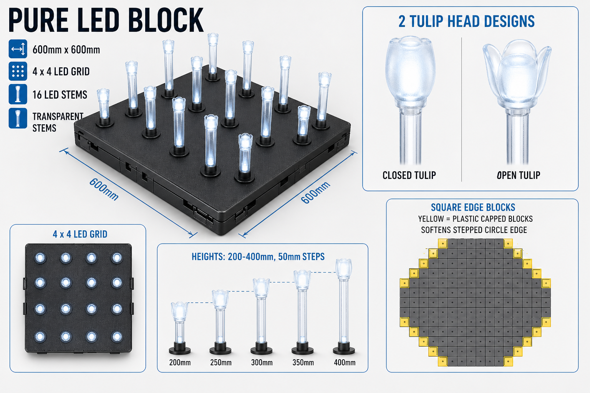

# LED Field Lights - Modular Block System
**Canvas From The Sky - Abu Dhabi Investor Pitch**

*Version 5 - pure LED block specification*
*Updated: 2026-04-26*

---

## Currency Note

Investor-facing budgets should be shown in **AED**, with USD only as a secondary reference for supplier benchmarking.

Working conversion:

```text
1 USD = 3.6725 AED
```

The UAE dirham is pegged to the US dollar, so this is stable enough for pitch-stage budgeting. Final procurement should still quote both AED and supplier currency.

---

## Executive Summary

The LED field is the core physical technology behind **Canvas From The Sky**. It turns the land around the tethered balloon into a programmable illuminated canvas that is atmospheric at ground level and fully legible from altitude.

Following CEO review, the system has been resized and rationalized for a more practical investor-stage deployment:

- **Outer diameter:** 60m
- **Inner clear circle:** 12m radius / 24m diameter
- **Active ring depth:** 18m
- **Main LED block size:** 600mm x 600mm
- **Stem layout per block:** 4 x 4 grid, or 16 LED stems
- **Ring-edge treatment:** square 600mm blocks remain; edge-zone blocks use plastic-capped portions where stems are omitted to make the stepped circle less noticeable
- **Access path:** 2m-wide LED mesh walkway under tempered structural glass from the outer edge to the balloon platform

This version keeps the spectacle but reduces the technical risk. The original 500mm / 100-stem module created a very dense field. The new 600mm / 16-stem block is easier to manufacture, easier to wire, easier to cool, and more realistic for cost control.

---

## Design Intent

The LED field must work as two connected experiences:

1. **Ground experience**
   Visitors move through a sculptural field of glowing stems. The stems vary subtly in height and sway lightly, creating a living garden effect rather than a flat technical grid.

2. **Balloon experience**
   From the gondola, the ring resolves into animated artwork: national moments, cultural imagery, sponsor stories, seasonal shows, and abstract aerial paintings.

The field is not simply decorative lighting. It is a repeatable cultural technology platform: a ground attraction, an aerial canvas, a sponsor medium, and a reason for guests to return.

---

## Final Field Geometry

The investor version uses a **60m outer diameter** with a **12m-radius inner clear circle** for the balloon platform zone.

```text
Outer radius:       30m
Inner radius:       12m
Active ring width:  18m

Active ring area:
pi x (30m^2 - 12m^2)
= approx. 2,375 sq m
```

### Access Walkway

A **2m-wide LED mesh walkway** connects the outer public edge to the inner balloon platform.

```text
Walkway length: approx. 18m
Walkway width:  2m
Walkway area:   approx. 36 sq m
```

Recommended treatment:

- structural steel or aluminum subframe
- LED mesh or low-profile LED tile below
- laminated tempered anti-slip glass above
- edge lighting for safety
- drainage below the glass layer
- removable service panels at intervals

The walkway should feel like a glowing bridge through the light field. It is also useful operationally: it gives guests, VIPs, maintenance teams, and emergency staff a clean controlled route between the field edge and the balloon platform.

### Approximate Quantity Model

| Item | Calculation | Estimate |
|---|---:|---:|
| Active ring area | pi x (30^2 - 12^2) | 2,375 sq m |
| Block size | 0.6m x 0.6m | 0.36 sq m |
| Gross block count | 2,375 / 0.36 | approx. 6,600 blocks |
| Walkway footprint | 18m x 2m | approx. 36 sq m |
| Blocks displaced by walkway | 36 / 0.36 | approx. 100 blocks |
| Net stem-block count | gross less walkway | approx. 6,500 blocks |
| Stems per block | 4 x 4 | 16 stems |
| Approx. stem lights | 6,500-6,600 x 16, before edge reductions | up to 104,000-105,600 lights |

For investor budgeting, use **6,500 main light blocks** and **105,000 stem lights maximum** as the clean working number. The final installed count may reduce slightly after edge-zone blocks are plastic-capped.

---

## Modular Block Architecture

Each LED block is a repeated 600mm x 600mm unit installed into a raised structural field frame.



```text
TULIP LED HEAD
  Replaceable diffuser/light cap
  2 visual variants for controlled natural randomness

FLEXIBLE / ADJUSTABLE STEM
  Set to chosen height before installation
  Slight flex for soft movement and safer contact

SEALED 600MM BASE BLOCK
  4 x 4 transparent LED stem positions
  edge-zone square blocks may receive plastic-capped portions
  Driver electronics, power, data, drainage separation

RAISED STRUCTURAL FRAME
  Airflow, water path, cable management, leveling
```

---

## Layer 1 - Raised Structural Frame

The LED blocks should not sit directly on the ground. They should sit on a continuous structural frame that lifts the active field above finished grade.

Recommended functions:

- keep LED blocks elevated for airflow
- create a water path below the modules
- allow cable trays and junction boxes below the field
- simplify leveling across the site
- protect electronics from standing water
- allow damaged modules to be lifted and replaced
- create a controlled service void

### Framing Options Reviewed

There are three practical directions for the structure below the LED blocks.

| Option | Description | Maintenance Access | Cost | Risk | Recommendation |
|---|---|---|---:|---|---|
| A. Technician crawl/service void | Raise or excavate enough space for a technician to physically enter below the field | Excellent | Highest | drainage, confined-space rules, ventilation, structural cost | Not recommended for first deployment |
| B. No frame, adjustable feet only | Each LED block sits on adjustable feet directly over prepared ground | Poor to medium | Lowest | cable disorder, uneven settlement, harder replacement, water exposure | Not recommended for flagship investor version |
| C. Low raised frame with lift-out blocks | 100-300mm raised structural grid; blocks sit on adjustable feet or leveling points; cables and drainage run below | Good | Medium | needs careful service hatch planning | Recommended |

### Recommended Cost-Effective Solution

Use **Option C: low raised structural frame with lift-out blocks**.

Recommended build-up:

```text
LED stems and tulip heads
600mm LED block
adjustable leveling feet / corner supports
raised structural grid
100-300mm service plenum
cable trays + drainage path
prepared ground slab or compacted civil base
```

Recommended height:

- **100mm minimum** in simple zones where only airflow and cable routing are needed
- **200-300mm preferred** in main service zones for better cable bends, junction boxes, drainage falls, and hand access
- **localized service trenches or hatches** at power/data junction routes

This avoids the cost of a full technician crawl space while still making the system maintainable. A technician should service the field from above by lifting modules, not by crawling under thousands of blocks.

### Maintenance Walkover Strategy

The LED stems should not be walked on directly during service. Instead, use a removable maintenance plank/stool system.

Recommended approach:

- leave engineered corner gaps or receiver points at selected block intersections
- create custom lightweight service stools/planks that bridge over the stems
- allow technicians to stand above the LED blocks without loading the stems
- use marked service routes aligned with structural beams
- include removable modules near junction boxes for deeper access

This gives the team the practical maintenance benefit of a service deck without the capital cost of building a full under-field access tunnel.

### Why Not a Full 300mm Technician Crawl Space?

A 300mm cavity is useful for cables and airflow, but it is generally not comfortable or safe for a technician to work inside. If the space is designed for a person to enter, it becomes a more serious civil/MEP system:

- higher excavation or deck height
- ventilation and heat management
- confined-space safety procedures
- lighting inside the void
- emergency access
- pest/sand/water management
- higher structural load requirements

For the investor version, the better message is: **modular top-side maintenance with a generous service plenum**, not an underground maintenance tunnel.

---

## Layer 2 - 600mm LED Block

**Size:** 600mm x 600mm  
**Stem grid:** 4 x 4  
**Stem count:** 16 LED stems per block  
**Top material:** coated aluminum or composite top plate  
**Underside:** sealed electronics enclosure with service connector  
**Ingress protection target:** IP67 for electronics enclosure  
**Service method:** lift individual module from frame and disconnect below

Why 600mm is the right move:

- better match for standard sheet and panel cutting
- fewer modules than 500mm blocks
- fewer connectors and failure points
- lower installation labor
- easier spacing for a 4 x 4 stem layout
- cleaner coordination with structural framing

### Stem Layout

The 4 x 4 grid should use a consistent mechanical grid, but the visible field should avoid looking too perfect.

Recommended approach:

- approx. 150mm nominal stem pitch
- inset border around the module edge
- subtle randomized stem heights
- 2 tulip head forms
- software color randomness at ground level

The aerial canvas remains mapped and precise, while the ground-level experience feels organic.

### Square Block Edge Treatment

The ring edge should not reveal a harsh stepped square-block outline. The physical modules remain square 600mm x 600mm blocks, but the blocks touched by the curved circle line should use capped plastic portions where the active LED field needs to visually soften the boundary.

Recommended approach:

- keep all base blocks square and standardized
- omit stems in the shaded/capped edge portions of selected boundary blocks
- cover those inactive areas with sealed plastic caps, not curved block pieces
- keep caps flush or slightly proud so dust and water do not collect
- map capped portions and omitted stems as inactive pixels in the content system

This keeps manufacturing simple while making the finished circular ring read cleaner from both ground level and balloon height.

---

## Layer 3 - Adjustable Flexible Stems

The stems should be adjustable before installation, then locked in place during commissioning.

Recommended requirements:

- transparent stem body with internal LED wiring/diffusion
- pre-set height range: 200-400mm
- height increments: 50mm
- adjustment before installation, not during daily operation
- locking collar or internal stop to fix final height
- flexible upper section to allow gentle sway
- UV-stabilized polycarbonate or hybrid polycarbonate/silicone design
- safe flex under light accidental contact
- replaceable stem only at module workshop level, not guest-facing daily maintenance

### Height Strategy

Use a controlled random height pattern, not true randomness.

Example height mix:

| Stem Height | Share | Purpose |
|---|---:|---|
| 200mm | 15% | low glow layer |
| 250mm | 20% | low-mid transition |
| 300mm | 30% | main visual field |
| 350mm | 20% | upper texture |
| 400mm | 15% | wave peaks and depth |

Each module can be pre-configured with a height recipe. When repeated across the ring, the field creates a subtle wave effect without compromising installation speed.

### Sway Strategy

The stems can flex slightly for a natural movement effect, but the design should avoid relying on wind as the main animation. Wind is unpredictable, and the balloon operation already has weather limits.

Recommended approach:

- passive sway from stem flexibility
- stronger visual wave created by content animation
- do not add motors in the first deployment

---

## Layer 4 - LED Tulip Heads

The LED head should not be a single repeated object across the whole field. A controlled family of heads will make the ground garden feel more natural.

Recommended family:

1. **Closed Tulip**
   Compact bud form, strongest point source, best for aerial brightness.

2. **Open Tulip**
   Wider frosted diffuser, softer at ground level, better for guest photos.

Use these in a controlled ratio, for example:

| Head Type | Share | Role |
|---|---:|---|
| Closed Tulip | 60% | aerial clarity and brightness |
| Open Tulip | 40% | ground-level softness and photo quality |

### Electrical Direction

For the first prototype, keep the tulip head simple:

```text
2-contact sealed connection
  LED power +
  LED power -
```

The addressable control and protection electronics should remain in the sealed base, not in the tulip head. This keeps the most exposed component cheaper and easier to replace.

Future premium option:

```text
4-contact sealed connection
  +V
  Ground
  Data
  Diagnostic / data return
```

This could support smarter heads later, but it adds complexity, cost, and weather-sealing risk.

---

## Walkway LED Mesh Under Tempered Glass

The walkway should be treated differently from the stem field. It needs to carry people, luggage, service equipment, and emergency access. It should therefore use a structural walking surface with LED content underneath.

Recommended build-up:

```text
Anti-slip laminated tempered glass
Clear air gap / service gap
Outdoor LED mesh or low-profile LED tile
Waterproof tray and drainage route
Structural subframe
Cable tray below
```

Design goals:

- the path glows as part of the show
- visitors feel they are walking through the artwork
- the path can guide boarding flow
- content can animate toward or away from the balloon platform
- glass panels remain removable for service

The path content should be simpler than the aerial ring content: flowing light, calligraphy trails, sponsor color moments, boarding guidance, and safety cues.

---

## Show Programming Strategy

CEO comment: the night should support **3-5 different shows**, allowing a guest night pass and repeat viewing.

This is a strong business improvement. Instead of one ride or one viewing moment, the venue becomes an evening destination.

### Recommended Night Program

| Time | Show | Duration | Role |
|---|---|---:|---|
| 7:00 PM | Welcome Canvas | 4-5 min | soft opening, family-friendly |
| 8:00 PM | UAE / Abu Dhabi Signature Show | 5-7 min | hero cultural show |
| 9:00 PM | Artist Canvas | 5-7 min | rotating commissioned artwork |
| 10:00 PM | Sponsor / Brand Edition | 3-5 min | commercial revenue slot |
| 11:00 PM | Night Finale | 5-8 min | high-energy closing show |

Between shows, the field can run ambient content loops. The shows should be scheduled clearly so guests have a reason to stay, eat, walk, photograph, and book another balloon slot.

### Night Pass Logic

The night pass can include:

- access to the ground light garden
- scheduled viewing of all shows
- F&B/retail dwell time
- option to add balloon flight as premium upgrade
- VIP reserved platform or lounge option

This separates venue revenue from balloon capacity. Even when the balloon is full or weather-limited, the ground experience can still generate value.

---

## Power and Thermal Strategy

The new 600mm / 16-stem block reduces density and makes the power model more credible.

Still, the field must not be treated like a full-white LED screen. It is an artistic canvas viewed from altitude, so the content should use controlled brightness, color, movement, and contrast.

Recommended controls:

- no sustained full-white scenes
- module-level brightness cap
- automatic thermal dimming
- lower daytime brightness
- show-specific power budget
- emergency dim or blackout mode
- temperature reporting per module or per zone

### Operating Modes

| Mode | Timing | Brightness Behavior | Purpose |
|---|---|---|---|
| Day sculpture | sunrise to late afternoon | 0-20% LED output | passive visual presence, thermal protection |
| Golden hour | late afternoon to sunset | 30-60% output | guest photography and arrival energy |
| Night ambient | between shows | 20-50% output | dwell time, atmosphere |
| Night show | scheduled showtimes | scene-dependent 40-100% peaks | aerial content and spectacle |
| Maintenance | staff-controlled | test patterns and diagnostics | service and commissioning |

---

## Data and Control System

Recommended hierarchy:

```text
Show control server
  TouchDesigner / MadMapper / Resolume / custom playback

Lighting network
  fiber backbone to field cabinets
  Art-Net / sACN control

Zone cabinets
  power distribution
  network switches
  environmental monitoring

Module controllers
  control 16 stems per block
  report temperature, moisture, voltage, fault status
```

The content pipeline should be built around the exact field geometry:

1. Survey final ring and walkway coordinates.
2. Assign every 600mm block an address.
3. Assign each installed LED stem a mapped position.
4. Create a top-down pixel map.
5. Test with drone or balloon-height calibration.
6. Adjust content for real-world viewing distance, haze, and gondola movement.

---

## Rough Cost Estimate - LED Field Hardware

These are early investor-level ranges, not supplier quotes. They are based on current online comparable products plus a custom-hardware uplift for desertized blocks, stems, tulip heads, sealing, controllers, structural framing, installation, and commissioning.

Investor-facing numbers should be shown in AED. USD is included only because many LED suppliers quote in USD.

### Comparable Supplier Ranges Observed

Alibaba listings show outdoor RGB pixel nodes and point lights at very wide USD ranges:

- basic waterproof WS2811-style pixels: about **$0.13-$0.28 per node**
- 30-50mm outdoor point pixels: about **$0.80-$2.20 per point**
- DMX facade / commercial point lights: about **$1.20-$2.80 per point**
- heavier outdoor RGBW / landscape pixels: about **$2.30-$4.60+ per point**
- outdoor transparent LED mesh varies widely, with buying guides commonly placing outdoor mesh around **$300-$600/sq m entry**, **$700-$1,200/sq m mid-range**, and higher for premium
- walkable laminated tempered glass listings vary widely, roughly **$35-$95/sq m** for more credible floor-panel references, before local structural certification and installation

Sources to validate during supplier outreach:

- Alibaba outdoor RGB pixel and point light listings
- Alibaba outdoor transparent LED mesh listings
- Alibaba LED mesh buying guides
- Alibaba walkable laminated tempered glass listings

### Main Ring Cost Model - AED

Working quantity:

- approx. **6,500 LED stem blocks**
- approx. **105,000 stem lights maximum**
- separate **36 sq m LED/glass walkway**

| Cost Layer | Low Range | Mid Range | High Range |
|---|---:|---:|---:|
| LED heads / light points | AED 1.8M | AED 3.3M | AED 5.5M |
| Stems, sockets, gaskets, custom diffusers | AED 1.5M | AED 2.9M | AED 5.1M |
| 600mm base blocks, controllers, wiring | AED 2.6M | AED 4.8M | AED 7.3M |
| Power, data, cabinets, control servers | AED 1.5M | AED 2.9M | AED 4.4M |
| Raised frame, adjustable feet, cable management | AED 2.2M | AED 4.4M | AED 7.3M |
| Walkway LED mesh, glass, path structure | AED 0.2M | AED 0.6M | AED 1.3M |
| Shipping, duties, spares, installation, commissioning | AED 2.9M | AED 5.5M | AED 9.2M |
| **Estimated installed system** | **AED 12.7M** | **AED 24.4M** | **AED 40.2M** |

### Cleaner Investor Range

For investor discussion, use:

```text
LED field installed system:
approx. AED 15M-30M target range

Conservative risk allowance:
up to AED 37M-40M before supplier quotes
```

USD equivalent:

```text
Target range: approx. USD 4M-8M
Risk allowance: approx. USD 10M-11M
```

The CEO concern is valid: the LED field is the major capital item. The updated density helps. The previous 100-stem 500mm block concept would likely have pushed the light count and power/cost profile too high for a first deployment.

### Cost-Control Levers

If the budget needs to come down:

- reduce selected boundary blocks below the 16-stem layout where plastic caps soften the circle edge
- use cluster control instead of individual control for early deployment
- keep tulip head variants to two molds
- make the first field 50m diameter instead of 60m
- keep walkway content low-resolution and atmospheric
- use premium density only in zones most visible from balloon viewing angles
- develop content that reads through motion and color, not dense video detail

---

## Rough Cost Estimate - Content Shows

The content package should be budgeted separately from hardware.

Because the field is not a normal rectangular screen, the first content package needs creative development, technical mapping, testing, calibration, and sound design. Once the mapping pipeline exists, future shows become cheaper.

### Market Benchmarks

Current animation and motion content benchmarks vary widely:

- freelancers: roughly **$500-$3,000 per minute** for 3D animation
- small studios: roughly **$3,000-$10,000 per minute**
- professional 3D animation companies: roughly **$8,000-$25,000+ per minute**
- premium cinematic work can go much higher
- sound design and music can add **$1,000-$5,000+** per show or package

For this project, normal per-minute animation rates are only a starting point. The field requires custom pixel-map adaptation, aerial testing, and show-control integration.

### Recommended Launch Content Budget

| Content Item | Estimate |
|---|---:|
| Creative direction, style frames, show bible | AED 150k-370k |
| Technical mapping pipeline and calibration | AED 185k-550k |
| 3-show launch package | AED 550k-1.3M |
| 5-show launch package | AED 920k-2.2M |
| Sound design / music package | AED 90k-370k |
| On-site testing and revisions | AED 150k-440k |

### Cleaner Investor Range

For investor discussion, use:

```text
Initial content system + 3-5 launch shows:
approx. AED 1.3M-3.3M

Premium cultural launch package:
approx. AED 3.7M-5.5M
```

Ongoing content refresh:

```text
New seasonal show:
approx. AED 185k-920k each
```

This range depends heavily on whether the show is abstract/generative, artist-led, 2D motion design, 3D cinematic, or sponsor-driven.

---

## ROI Model - Investor View

This model estimates incremental return from the LED field and night program. It should not double-count existing balloon sightseeing revenue unless the investor is funding the entire attraction.

### Revenue Streams Created or Improved by the LED Field

| Revenue Stream | Description |
|---|---|
| Night garden pass | paid ground access to the LED field and scheduled shows |
| Balloon art-show premium | higher ticket price or upgrade fee for show-synced balloon flights |
| Sponsorship | branded show slots, seasonal sponsor canvases, national/cultural partners |
| Private events | VIP flights, corporate events, product launches, exclusive show nights |
| F&B / retail uplift | longer dwell time from guests waiting for multiple shows |
| Content refresh | seasonal return visits driven by new shows |

### Ticket Market Reference

Current UAE tethered balloon references support a premium pricing position:

- Dubai Balloon Explorer adult pass is listed around **AED 195**
- Sunrise pass around **AED 220**
- Express pass around **AED 295**
- exclusive private flight from about **AED 2,995**

Canvas From The Sky should not be priced as a normal viewpoint. The LED show, night garden, and cultural content justify a separate night-pass product and a premium balloon-show ticket.

### Base ROI Assumptions

Use these as pitch-stage assumptions only:

| Variable | Conservative | Base Case | Strong Case |
|---|---:|---:|---:|
| Operating nights per year | 240 | 280 | 300 |
| Night garden guests / night | 400 | 800 | 1,200 |
| Average night pass | AED 95 | AED 125 | AED 150 |
| Balloon show riders / night | 250 | 400 | 550 |
| Incremental balloon premium | AED 100 | AED 150 | AED 200 |
| F&B/retail contribution per garden guest | AED 20 | AED 30 | AED 40 |
| Sponsorship / year | AED 2M | AED 4M | AED 7M |
| Private events / year | AED 1M | AED 2M | AED 4M |

### Annual Incremental Revenue Estimate

| Revenue Stream | Conservative | Base Case | Strong Case |
|---|---:|---:|---:|
| Night garden pass | AED 9.1M | AED 28.0M | AED 54.0M |
| Balloon show premium | AED 6.0M | AED 16.8M | AED 33.0M |
| F&B/retail contribution | AED 1.9M | AED 6.7M | AED 14.4M |
| Sponsorship | AED 2.0M | AED 4.0M | AED 7.0M |
| Private events | AED 1.0M | AED 2.0M | AED 4.0M |
| **Total annual incremental revenue** | **AED 20.0M** | **AED 57.5M** | **AED 112.4M** |

### EBITDA and Payback Estimate

Assume the LED field and content launch package require:

```text
Target CAPEX:
AED 18M-35M

Higher-risk CAPEX allowance:
AED 40M-45M
```

Assume operating expenses include staffing, power, cleaning, maintenance, show operations, insurance allocation, content refresh, and spares.

| Scenario | Revenue | EBITDA Margin Assumption | Annual EBITDA | Simple Payback |
|---|---:|---:|---:|---:|
| Conservative | AED 20.0M | 35-45% | AED 7.0M-9.0M | approx. 3-5 years |
| Base Case | AED 57.5M | 45-55% | AED 25.9M-31.6M | approx. 1-2 years |
| Strong Case | AED 112.4M | 50-60% | AED 56.2M-67.4M | under 1 year if demand is proven |

### Recommended Investor Claim

Use the base case carefully:

> With AED 18M-35M target CAPEX, the LED field can plausibly pay back in 1-3 years if the night-pass model, show premium, sponsorship, and private-event strategy are executed well.

Avoid promising the strong case. Keep it as upside.

### ROI Risks

- weather shutdowns reduce balloon-linked revenue
- content must be good enough to create repeat visits
- maintenance cost may rise if custom components fail faster than expected
- sponsorship depends on cultural positioning and government/private partner interest
- the night pass needs F&B, seating, shade/cooling, and guest-flow design to maximize dwell time
- first-year marketing spend may be higher than steady-state years

### ROI Strategy

The best ROI path is not only selling more balloon rides. It is turning the site into a night destination:

```text
Ground night pass
+ scheduled shows
+ premium balloon upgrade
+ sponsor canvases
+ F&B dwell time
+ private events
= diversified revenue beyond balloon capacity
```

This matters because balloon capacity is limited. The LED field creates revenue even when the balloon is sold out, between flights, or temporarily grounded by weather.

---

## Prototype Roadmap

### Phase A - Bench Prototype

Goal: prove one complete 600mm block.

Scope:

- 1-4 working 600mm modules
- 4 x 4 stem grid
- adjustable stem height system
- flexible sway test
- 2 tulip head shapes
- plastic-capped square edge-block portions for edge-condition testing
- elevated frame mock-up
- heat, dust, water, UV, and cleaning tests

Decision gates:

- final stem height range
- locking mechanism
- tulip shape family
- 2-contact electrical connection
- base material and sealing
- airflow gap and frame height

### Phase B - Garden Prototype

Goal: prove the ground experience and service logic.

Recommended scale:

- 8-10m test garden
- 50-100 modules
- up to 800-1,600 stem lights
- one short path segment with LED mesh and glass
- controlled height randomness
- basic content loops

Decision gates:

- emotional effect at ground level
- maintenance workflow
- walking safety
- real heat profile
- visibility from drone/elevated camera

### Phase C - Investor Pilot

Goal: prove aerial readability and investor confidence.

Recommended scale:

- 20-30m outer diameter pilot ring
- proportional inner void
- 500-1,500 modules
- one complete radial walkway
- 2-3 short shows
- balloon-height or crane/drone validation

Decision gates:

- content readability from height
- cost per installed square meter
- failure rate
- install speed
- maintenance staffing
- sponsor/demo event value

---

## Open Decisions

These need to be finalized before supplier engagement:

- final field diameter remains 60m or value-engineered smaller
- exact route and finish of the 2m walkway
- structural frame material and height
- 4 x 4 stem layout pitch and edge inset
- stem height range and locking detail
- flex material: polycarbonate, silicone hybrid, or composite stem
- two tulip head molds
- individual stem control vs grouped control
- whether walkway LED mesh is show-grade or atmospheric only
- target content package: 3 shows or 5 shows for launch
- supplier shortlist and prototype RFQ
- patent filing before manufacturer meetings

---

## Recommended Position for Abu Dhabi Investors

The updated design is easier to defend:

> A 60m illuminated aerial canvas built from 600mm desert-ready modular light blocks, with a glowing glass walkway leading guests into the balloon platform.

Investor talking points:

- lower-density system is more realistic and maintainable
- up to approx. 105,000 lights still creates a major spectacle
- 600mm blocks reduce manufacturing and installation complexity
- raised frame solves airflow, water, and cable-management concerns
- adjustable flexible stems create a premium ground-level garden
- multiple nightly shows support night-pass revenue
- content can rotate without rebuilding hardware
- the system can start as a pilot and scale to a destination attraction

The key message: this is not a one-time lighting installation. It is permanent cultural infrastructure with repeatable content revenue.
